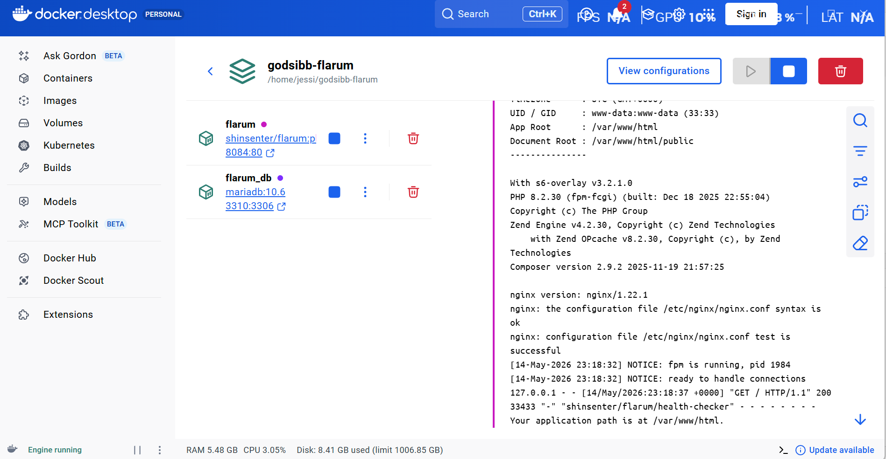
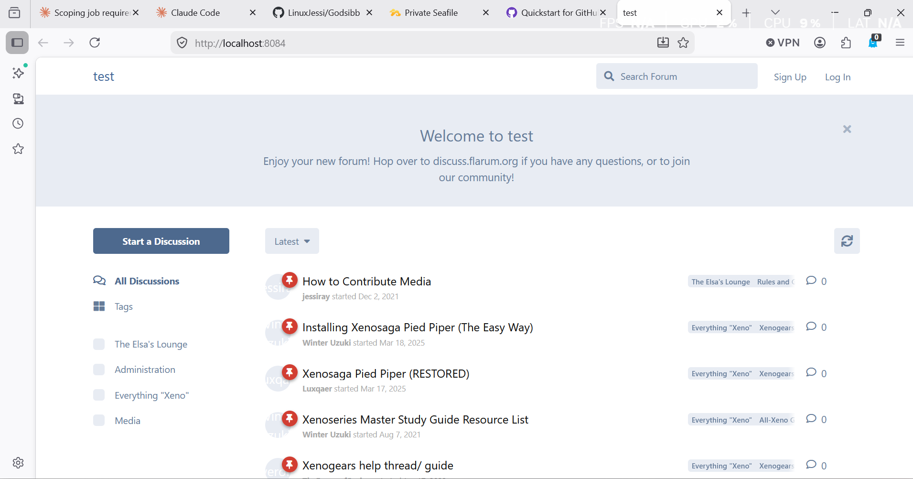
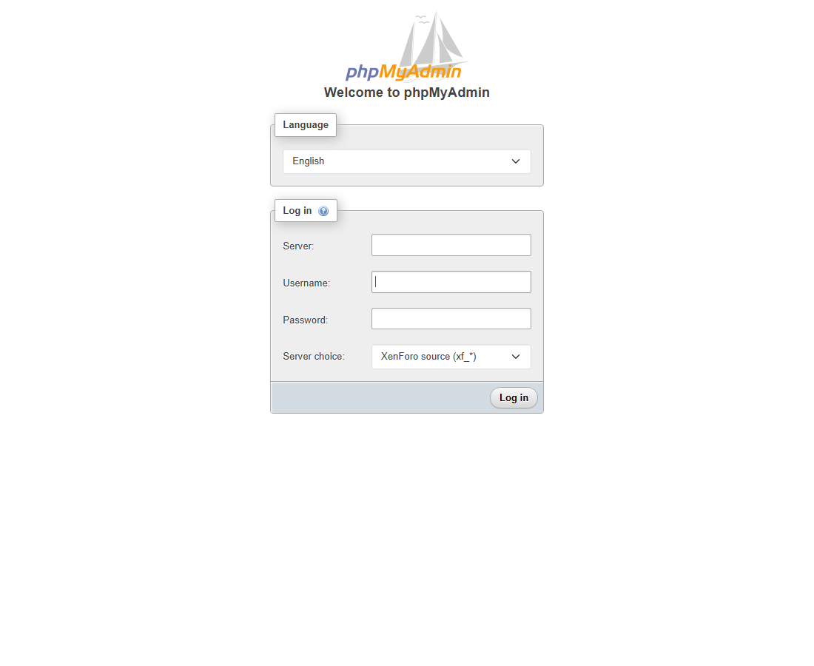
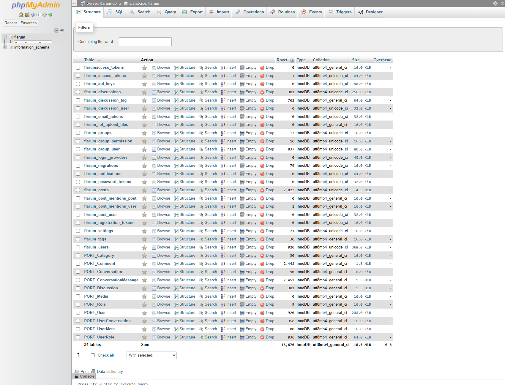

# xenforo2flarum

A Dockerised kit for migrating a **XenForo** forum to **Flarum** using
[nitro-porter](https://github.com/prosembler/nitro-porter) — wired up as two
Compose stacks that share a network, so nitro-porter writes straight into a
live Flarum database.

> **This kit is Docker-first.** Everything runs in containers — you need Docker
> and the Compose plugin, and not much else. It has been run end to end; the
> screenshots below are from an actual migration.

| Flarum stack running | Migrated content served |
|---|---|
|  |  |

## What this is

nitro-porter does the actual data conversion. **This kit is the scaffolding
around it** — the container setup that was the genuinely fiddly part:

- a **source** MySQL container that auto-imports your XenForo dump,
- nitro-porter itself in a PHP container,
- a **target** Flarum stack that auto-installs Flarum,
- phpMyAdmin so you can watch the data move between databases,
- the network glue that lets nitro-porter reach the Flarum DB directly.

It is meant to be a **clean, self-contained test harness** you can stand up,
run a migration through, inspect, and tear down — without touching production.

## How it works

Two Docker Compose stacks, joined by one shared network:

```
  porter/ stack  (network: xenforo2flarum_net)        flarum/ stack
  ┌─────────────────────────────────────────┐         ┌──────────────────────┐
  │  xenforo-db   ── your XenForo dump       │         │  flarum    :8084     │
  │   (MySQL)        imported on first boot  │         │   (auto-installs)    │
  │                                          │         │                      │
  │  porter-php   ── runs nitro-porter ──────┼────────▶│  flarum-db           │
  │   (FrankenPHP)   reads xenforo-db,       │  writes │   (MariaDB)          │
  │                  writes flarum-db        │ directly│                      │
  │  porter-db    ── nitro-porter scratch DB │         └──────────────────────┘
  │  porter-pma   ── phpMyAdmin  :8082       │          joins xenforo2flarum_net
  └─────────────────────────────────────────┘            as an external network
```

The `flarum/` stack declares `xenforo2flarum_net` as an **external** network, so
nitro-porter — running in `porter-php` — can connect to `flarum-db` by hostname
and write the converted tables straight in. That's why you start the `porter/`
stack first: it creates the network the `flarum/` stack expects to already exist.

## Prerequisites

- Docker + the Docker Compose plugin
- A **XenForo database dump** (`.sql`). The kit never ships real forum data —
  you provide your own, or use the included `db/sample-xenforo.sql` to smoke-test.
- A local **nitro-porter checkout** (it's AGPL third-party code — you clone it,
  this kit doesn't redistribute it). I maintain a small fork with two upstream
  fixes the kit depends on (see [KNOWN-ISSUES.md](KNOWN-ISSUES.md) for the why):
  ```sh
  git clone -b fix/flarum-postscript-and-discussions \
    https://github.com/LinuxJessi/nitro-porter.git
  ```
  Or use upstream and apply the two patches yourself — see KNOWN-ISSUES.md
  issues 1 & 2.

## Repo layout

```
xenforo2flarum/
├── porter/                  # overlay for your nitro-porter checkout
│   ├── compose.yml          #   the migration stack
│   ├── config.example.php   #   nitro-porter config → copy to config.php
│   ├── .env.example         #   DB passwords → copy to .env
│   ├── init-db.sh           #   imports your XenForo dump on first boot
│   ├── init-porter-db.sql   #   scratch-DB table nitro-porter expects
│   └── test-db.php          #   connectivity smoke test
├── flarum/                  # the target Flarum stack
│   ├── compose.yml
│   ├── .env.example
│   ├── install.yml.example  #   headless Flarum install config → copy to install.yml
│   └── init-flarum-db.sql
├── db/
│   └── sample-xenforo.sql   # tiny fake XenForo DB for smoke-testing
├── docs/screenshots/
├── verify.sh                # post-migration smoke test — counts + API check
├── KNOWN-ISSUES.md          # upstream snags + workarounds (read this!)
└── LICENSE                  # AGPL-3.0 (see "Credits & license")
```

## Quick start

### 1. Stand up the porter stack

```sh
git clone -b fix/flarum-postscript-and-discussions \
  https://github.com/LinuxJessi/nitro-porter.git
cd nitro-porter

# Copy this kit's porter/ files into the checkout:
cp -r /path/to/xenforo2flarum/porter/. .
cp -r /path/to/xenforo2flarum/db .

cp .env.example .env                 # fill in the XenForo DB passwords
cp config.example.php config.php     # fill in source/target DB credentials

# Provide the data to migrate — your own dump, or the sample:
cp db/sample-xenforo.sql db/source.sql

docker compose up --build -d
docker compose exec frankenphp composer install
```

`xenforo-db` imports `db/source.sql` on first boot. Check progress with
`docker compose logs -f xenforo-db`.

### 2. Stand up the Flarum stack and run the headless install

```sh
cd /path/to/xenforo2flarum/flarum
cp .env.example .env                 # fill in the Flarum DB passwords
cp install.yml.example install.yml   # fill in admin user + match DB password
docker compose up -d
docker compose logs -f flarum        # wait for "ready to handle connections"
```

The `shinsenter/flarum` image only stages the Flarum codebase on first boot —
it does **not** create the DB schema or admin user. Once the logs show
"ready to handle connections", install Flarum non-interactively from the
mounted `install.yml`:

```sh
docker compose exec flarum php flarum install --file=/install.yml
```

That single command runs Flarum's migrations + seeds and creates the admin
account from `install.yml`. After it completes, Flarum writes `config.php`
inside the container and won't re-install on subsequent boots.

> ⚠️ **Don't visit <http://localhost:8084> before running the install command.**
> The setup-wizard route is the same `install` workflow; if you start the
> wizard in the browser, it can race the CLI install. Run the CLI install
> first, then visit the URL to log in.

### 3. Run the migration

With both stacks up and Flarum installed, confirm nitro-porter can see both
databases, then run it from inside the `porter-php` container:

```sh
# from your nitro-porter checkout:
docker compose exec frankenphp php test-db.php   # expect: OK source / OK target
docker compose exec frankenphp php bin/porter run
```

`bin/porter run` reads `config.php`. See nitro-porter's
[User Guide](https://nitroporter.org/guide) for CLI flags and overrides.

> ⚠️ **`target_prefix` must be `flarum_`** (with the trailing underscore) in
> `config.php`. nitro-porter concatenates this prefix to table names literally,
> so a bare `flarum` creates ghost tables (`flarumusers`, `flarumposts`) that
> Flarum's UI will never read. The example config ships with the correct
> value — don't override it unless you've customised Flarum's table prefix.

### 4. Verify the migration

```sh
# From the kit root (where this README lives):
./verify.sh
```

That script samples the migrated database and the public Flarum API, then
prints one ✓/✗ line per check. A healthy run looks like:

```
==> Patch-specific checks
  ✓  promoteAdmin wrote at least one admin        1
  ✓  discussions actually landed (not silently dropped) 381
  ✓  no orphan posts (every post has a discussion) 0

==> Public API
  ✓  http://localhost:8084/ responds 200          200
  ✓  API returns at least one discussion to a guest 1

All 15 checks passed. Migration looks healthy.
```

Then open <http://localhost:8084> — your XenForo users, categories,
discussions and posts should be there.

> ⚠️ **nitro-porter never migrates permissions.** Reassign them in Flarum
> after the migration. The admin user identified by `PORT_User.Admin > 0`
> is promoted to group_id=1 automatically (the LinuxJessi/nitro-porter fork
> linked above includes that fix); everyone else lands in Members only.

To start over: `docker compose down -v` on both stacks wipes the databases.

## Inspecting the databases

phpMyAdmin runs at <http://localhost:8082>. The kit pre-populates the
**Server choice** dropdown with all three databases in the stack, so you don't
need to memorise hostnames — pick the one you want, enter your DB credentials
from `.env`, and you're in. `PMA_ARBITRARY` is also on so the Server text
field stays available for ad-hoc connections.



| Pick from the dropdown | Database | What's in it |
|---|---|---|
| **XenForo source (xf_*)** | `xenforo` | the imported XenForo source data |
| **Porter scratch (PORT_*)** | `porter`  | nitro-porter's scratch space |
| **Flarum target (flarum_*)** | `flarum`  | the migrated Flarum forum |

Inside the Flarum target database you'll see both the live `flarum_*` tables
and the `PORT_*` scratch tables nitro-porter wrote while normalising your
source data. That side-by-side view is the easiest way to confirm a run did
what you expected — every `PORT_Discussion` row should have a corresponding
`flarum_discussions` row, and `flarum_users` should match `PORT_User`'s count:



The `PORT_*` tables are safe to drop after a successful migration — nitro-porter
will tell you so at the end of `bin/porter run`.

## Gotchas & lessons learned

Things that cost real time the first time around — folded back into this kit:

- **It's `php flarum`, not `php artisan`.** Flarum is not Laravel. Plenty of
  AI-generated guides hand you `artisan` commands; they will not work.
- **`shinsenter/flarum`'s `INITIAL_PROJECT` stages the codebase, NOT the
  install.** It only runs `composer create-project` — no DB schema, no admin
  user. You still have to run `php flarum install --file=...` once. The image
  has no Flarum-aware `FLARUM_ADMIN_*` env vars (those belong to other
  maintainers' images like `mondedie/docker-flarum`).
- **Don't mount an empty host dir over the Flarum app.** The `shinsenter/flarum`
  image ships Flarum *inside* the image. Bind-mounting an empty `./flarum` over
  `/var/www/html` wipes it and you get nginx 403s. This kit mounts only
  `install.yml` into the app — no full app bind mount.
- **`target_prefix` is `flarum_` with a trailing underscore.** nitro-porter
  concatenates this onto table names directly, so a bare `flarum` writes ghost
  tables Flarum will never read. See the warning in Quick Start step 3.
- **`.env` must be a file, not a directory.** A stray `mkdir env` (or a bad
  bind mount) leaves you with a *directory* named `.env` inside the container
  and a Flarum that can't read its config.
- **Start `porter/` before `flarum/`.** The `flarum/` stack joins
  `xenforo2flarum_net` as an `external` network — it has to exist already.
- **nitro-porter expects a couple of tables that don't exist yet.** The
  `init-*.sql` files pre-create them; they're `CREATE TABLE IF NOT EXISTS`, so
  harmless if they already exist.
- **Permissions never transfer.** Always reassign them in Flarum after a run.

## Credits & license

- **[nitro-porter](https://github.com/prosembler/nitro-porter)** by Lincoln
  Russell & contributors does the actual migration. This kit does not
  redistribute it — you clone it yourself.
- **[shinsenter/flarum](https://github.com/shinsenter/docker-flarum)** provides
  the Flarum Docker image.

nitro-porter is licensed under the **GNU AGPL-3.0**. This kit's `compose.yml` is
derived from nitro-porter's own Compose file, so the kit is released under the
same license — see [LICENSE](LICENSE).
